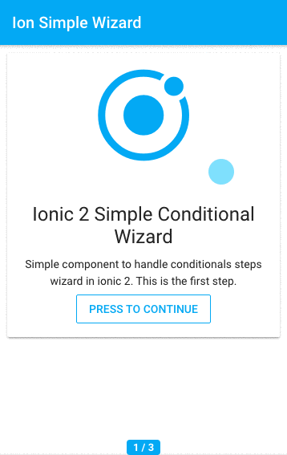

# Ionic (3.9.2) Simple Conditional Wizard

Simple component to handle conditionals steps wizard in ionic 3.

## Getting Started

* Clone this repository.
* Run npm install from the project root.
* Install the ionic CLI (npm install -g ionic)
* Run ionic serve in a terminal from the project root.


## Using this component in your projects

* Copy and paste ion-simple-wizard component files from <a href='/src/pages/'>pages folder</a>.
* Import it and declare the 'IonSimpleWizard' and 'IonSimpleWizardStep' component and 'BrowserAnimationsModule' module in the app.module.ts file:
```
...
import {IonSimpleWizard} from '../pages/ion-simple-wizard/ion-simple-wizard.component';
import {IonSimpleWizardStep} from '../pages/ion-simple-wizard/ion-simple-wizard.step.component';
import { BrowserAnimationsModule } from '@angular/platform-browser/animations';

@NgModule({
  declarations: [
    MyApp,
    HomePage,
    IonSimpleWizard,
    IonSimpleWizardStep
  ],
  imports: [
    BrowserAnimationsModule
  ]
  ...
```
* Now you can use the wizard like this:
```
<ion-simple-wizard [(step)]="step" [showSteps]="true" (finish)="onFinish()" [finishIcon]="'done-all'" [(stepCondition)]="stepCondition">
    <ion-wizard-step>
      Step 1 content
    </ion-wizard-step>
    <ion-wizard-step>
      Step 2 content
    </ion-wizard-step>
    ...
    <ion-wizard-step>
      Step N content
    </ion-wizard-step>
</ion-simple-wizard>


```
## Wizard Options
* [(step)] : step counter of the wizard, set it to 1 by default 
* [showSteps] : true if you want to show the steps counter in the wizard
* (finish): The event will be fire when the wizard is finish
* [finishIcon]: ion-icon name for the last step, see the names here: <a href="http://ionicframework.com/docs/v2/ionicons/" target="_blank">Ionicons</a>
* [(stepCondition)]: Condition of the next step of the wizard, you can change it in every step.
* Example of initial settings:
```
    this.step = 1;//The value of the first step, always 1
    this.stepCondition = false;//Set to true if you don't need condition in every step
    this.stepDefaultCondition = this.stepCondition;//Save the default condition for every step

```
## Animations
* Checkout the <a href='/src/pages/ion-simple-wizard/ion-simple-wizard-animations.ts'>ion-simple-wizard-animations.ts</a> file to see the availables step and buttons animations.
* To change the wizard navigation buttons animations go to the file 'ion-simple-wizard.component.ts' and modify the value in the @Component:
```
@Component({
  selector: 'ion-simple-wizard',
  templateUrl: 'ion-simple-wizard.component.html',
  animations: WizardAnimations.btnRotate//Change 'btnRotate' for any other animation with the prefix btn
})

```
* To change the step animation go to the file 'ion-simple-wizard.step.component.ts' and modify the value in the @Component:
```
@Component({
    selector: 'ion-wizard-step',
    host: {
        '[@WizardAnimations]': 'isCurrent ?"enter":"leave"'
    },
    template: `
    <ng-content></ng-content>
  `,
    animations: WizardAnimations.zoom//Change 'zoom' for any other animation
})

```
## Events
You can subcribe to the following ionic 2 Events:
* 'step:changed'
```
//You can subscribe to the Event 'step:changed' to handle the current step
    this.events.subscribe('step:changed', step => {
      //Handle the current step if you need
      this.currentStep = step[0];
    });
```
* 'step:next'
```
this.events.subscribe('step:next', () => {
      //Do something if next
      console.log('Next pressed: ',this.currentStep);
    });
```   
* 'step:back'
```
 this.events.subscribe('step:back', () => {
      //Do something if back
      console.log('Back pressed: ',this.currentStep);
    });
```
## Ionic Info
```

cli packages:

    @ionic/cli-utils  : 1.19.2
    ionic (Ionic CLI) : 3.20.0

global packages:

    cordova (Cordova CLI) : 7.0.1 

local packages:

    @ionic/app-scripts : 3.1.8
    Cordova Platforms  : android 6.1.0 ios 4.1.1
    Ionic Framework    : ionic-angular 3.9.2

System:

    ios-deploy : 1.9.2 
    ios-sim    : 5.0.3 
    Node       : v7.6.0
    npm        : 4.1.2 
    OS         : macOS High Sierra
    Xcode      : Xcode 9.2 Build version 9C40b 

Environment Variables:

    ANDROID_HOME : /usr/local/opt/android-sdk

Misc:

    backend : legacy

```

## Platforms
* Android (Tested in 6.0)
* iOS (Tested in 10.2)

## Preview
 

## TO DO
- [ ] Test in other platforms.
- [ ]  Improve the animations or steps transitions.
- [ ]  Improve the wizard hide when the keyboard is open.
- [ ]  Others improvements or new features are welcome :) 

 ## Credits
 * Thanks to <a href="https://github.com/nickjohnson-dev" target="_blank">@nickjohnson-dev</a>  for this awesome gist: 
 <a href='https://gist.github.com/nickjohnson-dev/45d1610b7f82ce565f8c5ac615df87b5' target="_blank">Angular 2 simple wizard</a>
 